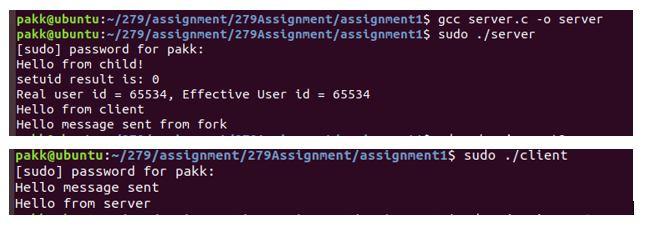
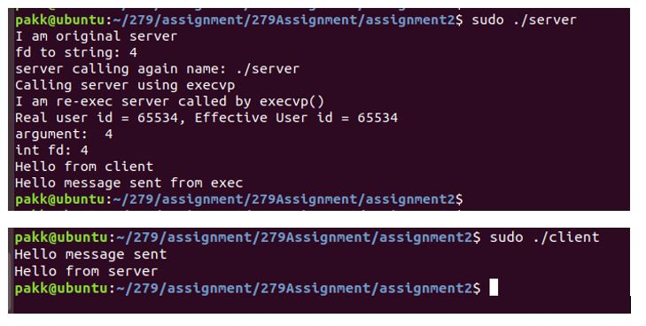

# 279Assignment
To improve the security posture of a socket-based client/server system by adding additional security hardening and mitigation

# Assignment 1
Server: 
gcc server.c -o server 
sudo ./server 
 
Client:  
gcc client.c -o client 
sudo ./client 
 

# Assignment 2
Server: 
gcc server.c -o server 
sudo ./server 
 
Client:  
gcc client.c -o client  
sudo ./client 
 

